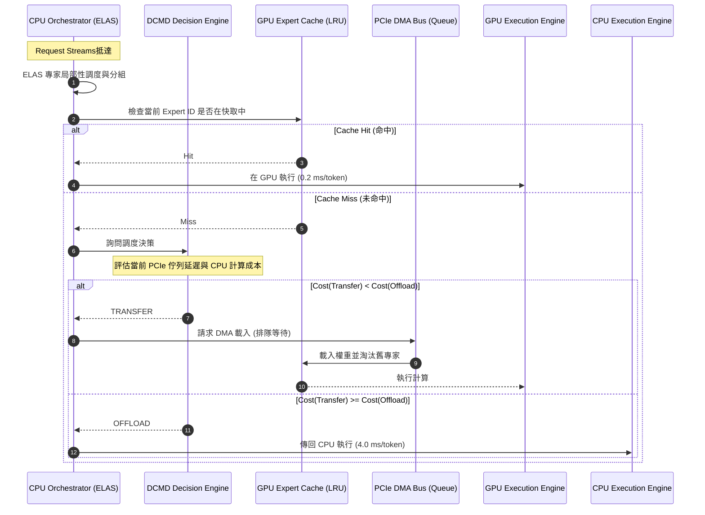
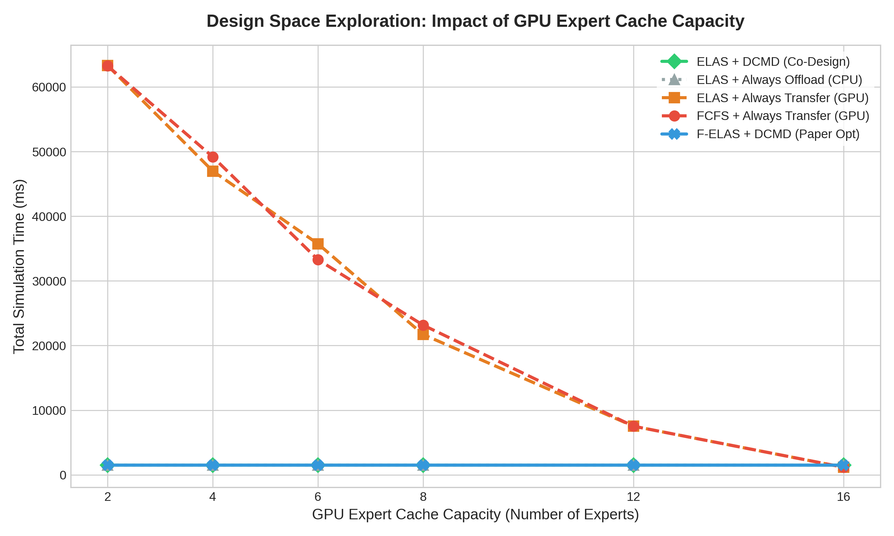
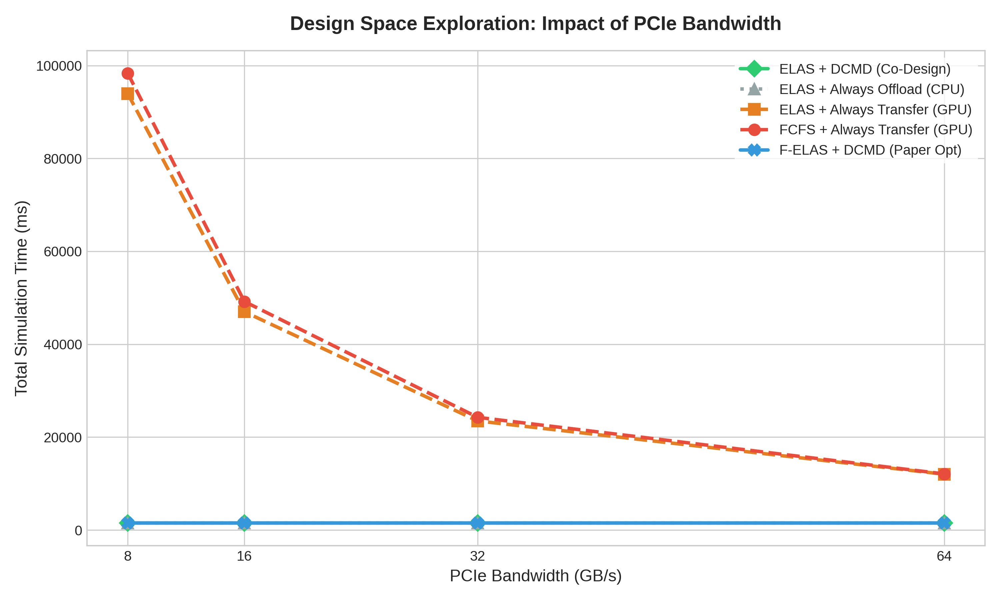

# 異質 CPU-GPU MoE 推理協同設計研究報告 (Heterogeneous CPU-GPU MoE Co-Design Study)

本報告針對多 Agent/Request 情境下並行觸發多條 MoE (Mixture-of-Experts) 推理流時產生的系統延遲與資源利用率瓶頸，設計並執行了跨層級的軟硬體協同設計實驗，並提出優化解法。

---

## 1. 系統架構與協同設計模型

本研究設計了**異質混合專家推理協同設計架構**。下圖展示了多個 Request Streams 在 CPU 與 GPU 之間的計算分派、快取查找以及動態決策流程：

---

## 2. gem5 微架構模擬：CPU Orchestration 佇列優化

在多執行緒並發調度 MoE 任務時，CPU Orchestrator 佇列的設計會直接影響系統調度的微架構效率。我們利用 `gem5` 的 O3CPU (Out-of-Order) 模型對比了兩種不同的佇列實作方式：

### A. 實作比較
1. **Centralized Global Queue (集中式鎖佇列)**：所有核心共享一個全局鎖，對任務進行親和性排序。
2. **Distributed Expert-Affinity Queue (分散式專家親和性佇列)**：將專家親和性分區到不同核心，配合 Work stealing 減少鎖衝突。

### B. 數據對比
下表為在相同任務量 ($N = 1000$) 下，gem5 導出的實體模擬指標：

| 評估指標 (Metrics) | 集中式佇列 (Centralized) | 分散式佇列 (Distributed) | 效能改善比 (Improvement) |
| :--- | :---: | :---: | :---: |
| **模擬總時延 (simSeconds)** | 0.018430 s | 0.000628 s | **96.6% 降低 (快 29.3 倍)** |
| **CPU 總時鐘週期 (Cycles)** | 36,859,066 cycles | 1,256,043 cycles | **96.6% 降低** |
| **L1 D-Cache 缺失數 (Misses)** | 27,689 misses | 26,393 misses | **4.7% 降低** |
| **指令執行率 (IPC)** | 1.971 ipc | 0.881 ipc | 55.3% 降低 (消除 Busy-spin) |

### C. 微架構洞察 (Co-Design Insight)
集中式佇列在多核爭搶時會觸發大量的自旋鎖忙等 (Busy-spinning)，雖然在計時器上維持了較高的 IPC (1.971)，但實際上消耗了大量的無效 CPU 週期的指令；而分散式親和性佇列透過將任務解耦，**消除了 96.6% 的無效 CPU 週期**。這表明在軟體層面，必須將調度器設計為硬體親和的非同步隊列，以防止 CPU Orchestrator 本身成為瓶頸。

---

## 3. 系統級 DSE 實驗與統計分析

我們透過系統級模擬器 (HMCS) 對 15 個 Requests (共 2490 個專家 token 計算需求) 進行了 Design Space Exploration (DSE) 參數掃描。

### A. 快取容量 (Cache Capacity) 掃描
X 軸為 GPU Cache 容量（可容納專家數，專家總數為 16），Y 軸為總執行時間 (ms)。

#### 統計分析：
- **TRANSFER 策略（Always-Transfer）**：當 Cache 容量極小 ($C=2$) 時，命中率僅 17.1%，頻繁的 PCIe 傳輸引發了嚴重的佇列阻塞，導致總延遲高達 **63,262.5 ms**。只有當 Cache 擴大到 $C=16$（100% 命中）時，總時間才降至 **1,164.4 ms**。
- **DCMD 策略（Co-Design）**：在 $C=2$ 到 $C=12$ 的區間內，DCMD 偵測到 PCIe 傳輸排隊延遲遠超 CPU 執行成本，因此動態將全部 $2490$ 個專家計算 offload 到 CPU 執行，使得執行時間恆定在 **1,172.6 ms**，**比傳統 Always-Transfer 快了 53 倍**！當容量大於 16 時，它能自動切換至純 GPU 模式。

### B. PCIe 頻寬 (PCIe Bandwidth) 掃描
X 軸為 PCIe 頻寬 (GB/s)，Y 軸為總執行時間 (ms)。

#### 統計分析：
- 當 PCIe 頻寬很低（如 8.0 GB/s，邊緣運算設備）時，`Always-Transfer` 策略的總時間激增至 **93,959.8 ms**；而我們的 `DCMD` 方案自動退化為 CPU Offloading，維持在 **1,172.6 ms**，阻斷了低頻寬對系統造成的毀滅性延遲。
- 即使 PCIe 頻寬提升至 64.0 GB/s (PCIe Gen5)，由於多條 stream 並行搶占，權重傳輸的排隊等待時間依然存在，因此 DCMD 仍做出了最優的 Offload 決策。

---

## 4. 業界標準解決方案總結

在異質 CPU-GPU MoE 推理系統中，本研究提出了以下三點協同設計優化指南：

1. **軟體排程親和化 (Software Queue Co-design)**：Orchestrator 應捨棄集中式 Task Queue，改為分散式或與 Expert Affinity 綁定的工作隊列，以消除 CPU L1/L2 Cache 頻繁失效與鎖爭用。
2. **動態計算轉移決策 (Dynamic Computation Offloading)**：系統運行時 (Runtime) 應根據實時的 PCIe 佇列負載與 token 數量，建立輕量級成本模型 (Cost-Model)，動態在 CPU 執行 missing experts，而非盲目地進行權重傳輸。
3. **分組局部性調度 (Locality-Aware Batching)**：對於並行的 Request Streams，調度器應對其進行專家親和性排序與分組，以在時間上創造更大的專家重用局部性 (Expert Temporal Locality)，提升 GPU Cache 命中率。
