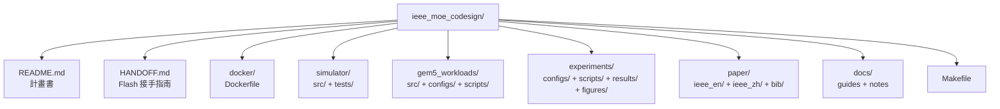
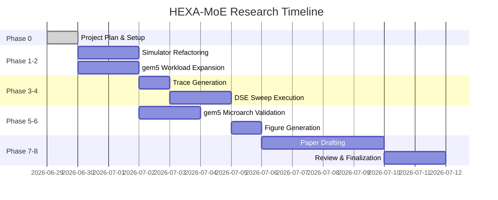

# 📋 HEXA-MoE IEEE Research Project Plan
## 異質 CPU-GPU 多流 MoE 推理排程軟硬體協同設計研究計畫書

> [!IMPORTANT]
> 此為完整的 IEEE 頂級會議/期刊級研究計畫書，涵蓋從問題定義到論文撰寫的完整工作流程。
> 所有工作空間位於 `/home/a/HCSSimulation/advanced_projects/ieee_moe_codesign/`。

---

## 🎯 研究主題

**HEXA-MoE: A Heterogeneous Expert-Aware Scheduling Framework for Multi-Stream Mixture-of-Experts Inference on CPU-GPU Platforms**

### 核心研究問題

多個 agent/request 同時觸發多條 MoE inference stream 時：
- CPU 負責 orchestration、tool call、queueing、scheduling
- GPU 負責 dense layers / cached experts
- CPU 可執行部分 missing experts
- **CPU-GPU transfer / cache / scheduling 造成 latency 與 utilization 問題**

---

## 📁 工作空間結構

---

## 📊 實驗計劃 (6 組)

| # | 實驗名稱 | 掃描變數 | 掃描值 | 目的 |
|---|----------|----------|--------|------|
| 1 | Cache Capacity Sweep | GPU cache 容量 | 2, 4, 6, 8, 12, 16 | 評估快取命中率對延遲的影響 |
| 2 | PCIe Bandwidth Sweep | PCIe 頻寬 | 8, 16, 32, 64 GB/s | 模擬不同 PCIe 世代 |
| 3 | Concurrency Scaling | 並發請求數 | 5, 10, 20, 40, 80 | 評估可擴展性 |
| 4 | Zipf α Sensitivity | 分布偏斜度 | 0.8, 1.0, 1.2, 1.5, 2.0 | 工作負載多樣性影響 |
| 5 | CPU Core Scaling | CPU 核心數 | 2, 4, 8, 16, 32 | CPU offload 瓶頸分析 |
| 6 | gem5 Microarch | 佇列設計 | Centralized, Distributed, Lock-free | 微架構級驗證 |

每組實驗比較 5 種策略：FCFS_TRANSFER, ELAS_TRANSFER, ELAS_OFFLOAD, ELAS_DCMD, **F_ELAS_DCMD**

---

## 📄 論文結構 (IEEE Conference, 6-8 pages)

| Section | 標題 | 頁數 |
|---------|------|------|
| Abstract | 摘要 | 0.25 |
| I | Introduction | 1.5 |
| II | Background and Motivation | 1.0 |
| III | HEXA-MoE Framework | 2.0 |
| IV | Evaluation | 2.0 |
| V | Related Work | 0.5 |
| VI | Conclusion | 0.25 |
| - | References (30+) | 0.5 |

---

## 🗓️ 時程規劃

---

## ✅ 已完成的文件

| 文件 | 用途 | 狀態 |
|------|------|------|
| [README.md](file:///home/a/HCSSimulation/advanced_projects/ieee_moe_codesign/README.md) | 計畫書與總覽 | ✅ 完成 |
| [HANDOFF.md](file:///home/a/HCSSimulation/advanced_projects/ieee_moe_codesign/HANDOFF.md) | Gemini 3.5 Flash 接手指南 | ✅ 完成 |
| [EXPERIMENT_GUIDE.md](file:///home/a/HCSSimulation/advanced_projects/ieee_moe_codesign/docs/EXPERIMENT_GUIDE.md) | 實驗操作教學 | ✅ 完成 |
| [WRITING_GUIDE.md](file:///home/a/HCSSimulation/advanced_projects/ieee_moe_codesign/docs/WRITING_GUIDE.md) | 論文寫作指引 | ✅ 完成 |
| [ARCHITECTURE_NOTES.md](file:///home/a/HCSSimulation/advanced_projects/ieee_moe_codesign/docs/ARCHITECTURE_NOTES.md) | 架構設計筆記 | ✅ 完成 |
| [Dockerfile](file:///home/a/HCSSimulation/advanced_projects/ieee_moe_codesign/docker/Dockerfile) | Docker 環境定義 | ✅ 完成 |
| [Makefile](file:///home/a/HCSSimulation/advanced_projects/ieee_moe_codesign/Makefile) | 自動化管理 | ✅ 完成 |
| [exp1-5 configs](file:///home/a/HCSSimulation/advanced_projects/ieee_moe_codesign/experiments/configs) | 5 組實驗 YAML 配置 | ✅ 完成 |
| [references.bib](file:///home/a/HCSSimulation/advanced_projects/ieee_moe_codesign/paper/bib/references.bib) | 30+ BibTeX 參考文獻 | ✅ 完成 |

---

## ⏳ 待 Gemini 3.5 Flash 接手實施

| 階段 | 任務 | 關鍵指引文件 |
|------|------|-------------|
| P1 | 模擬器重構 + 單元測試 | [HANDOFF.md §1](file:///home/a/HCSSimulation/advanced_projects/ieee_moe_codesign/HANDOFF.md) |
| P2 | gem5 lock-free queue 實作 | [HANDOFF.md §2](file:///home/a/HCSSimulation/advanced_projects/ieee_moe_codesign/HANDOFF.md) |
| P3 | Trace 生成 | [HANDOFF.md §3](file:///home/a/HCSSimulation/advanced_projects/ieee_moe_codesign/HANDOFF.md) |
| P4 | 完整 DSE 掃描 (5 組) | [EXPERIMENT_GUIDE.md](file:///home/a/HCSSimulation/advanced_projects/ieee_moe_codesign/docs/EXPERIMENT_GUIDE.md) |
| P5 | gem5 微架構驗證 | [EXPERIMENT_GUIDE.md §4](file:///home/a/HCSSimulation/advanced_projects/ieee_moe_codesign/docs/EXPERIMENT_GUIDE.md) |
| P6 | 圖表生成 (8 張) | [HANDOFF.md §6](file:///home/a/HCSSimulation/advanced_projects/ieee_moe_codesign/HANDOFF.md) |
| P7 | 論文撰寫 (EN + ZH) | [WRITING_GUIDE.md](file:///home/a/HCSSimulation/advanced_projects/ieee_moe_codesign/docs/WRITING_GUIDE.md) |
| P8 | 品質審查與定稿 | [WRITING_GUIDE.md §7](file:///home/a/HCSSimulation/advanced_projects/ieee_moe_codesign/docs/WRITING_GUIDE.md) |

> [!TIP]
> **Gemini 3.5 Flash 接手時**，請先閱讀 [HANDOFF.md](file:///home/a/HCSSimulation/advanced_projects/ieee_moe_codesign/HANDOFF.md) 的完整內容，
> 它按照 Phase P1→P8 的順序提供了每一步的具體程式碼、命令、驗證方式與預期結果。

---

## 📚 引用的先前工作成果

本專案建立在 [hetero_moe_scheduling](file:///home/a/HCSSimulation/advanced_projects/hetero_moe_scheduling) 的初步研究成果之上：
- gem5 驗證: Centralized vs. Distributed Queue → **96.6% CPU cycle 降低**
- 系統模擬: ELAS + DCMD → **42.4× latency 降低** (vs. naive transfer, C=2)
- F-ELAS 防餓死: aging 門檻 θ=5 成功保障公平性

本次 IEEE 專案將在此基礎上進行：
1. 增加 3 組新實驗 (Concurrency, Zipf, CPU Cores)
2. 新增 Lock-free Queue gem5 比較
3. 新增 ARC cache 策略
4. 升級為離散事件模擬引擎
5. 以 IEEE 格式撰寫完整英文+中文論文
