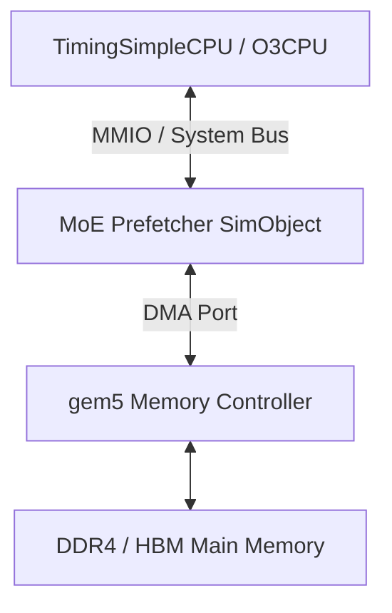

# MoE Routing-aware Prefetcher gem5 建模與整合規劃書

本規劃書旨在定義如何將 **Routing-aware Expert Prefetcher** 與 **Expert Cache** 整合至 **gem5** 系統模擬器中，提供 CPU/加速器運行 MoE 模型時的週期精確 (Cycle-Accurate) 效能分析與硬體探索平台。

---

## 1. 系統架構與定位

在 gem5 中，我們將此專案之 prefetch 系統建模為一個自定義的 **SimObject**，掛載在系統系統匯流排 (System Bus) 上。它能模擬當 CPU 執行 MoE 工作負載時，透過特定介面與硬體預取控制器互動的行為。



### 1.1 整合方案選擇
- **方案 A (推薦 - MMIO Co-processor)**：將其建模為一個特殊的 I/O 裝置 (MMIO SimObject)，軟體透過讀寫 MMIO 暫存器來發起 Demand Requests 與 Prefetch Hints。此方案易於實作、與目前 RTL/Python 介面最為貼近。
- **方案 B (進階 - Custom Cache Controller)**：繼承 gem5 的 `BasePrefetcher` 或者是 `Ruby Cache`，直接掛載於 L1/L2 專家緩衝區中。此方案較為複雜，但能更精確地與 gem5 既有的快取階層融合。

---

## 2. MMIO 暫存器映射 (Register Mapping)

當軟體 (如 PyTorch / C++ runtime) 執行 MoE 推理時，透過寫入特定 MMIO 地址，將指令與 hint 傳遞給 prefetch 控制器。

| 偏移地址 (Offset) | 暫存器名稱 | 讀/寫 (R/W) | 說明 |
| :--- | :--- | :---: | :--- |
| `0x00` | `CTRL_REG` | R/W | **控制暫存器**：[0] prefetch_enable, [1] replacement_policy_sel (0=FIFO, 1=LRU) |
| `0x08` | `THRES_REG` | R/W | **評分門檻暫存器**：設定 prefetch 的 score threshold |
| `0x10` | `DEMAND_REG` | W | **Demand 專家請求暫存器**：寫入此位址（包含 expert_id）代表當下 pipeline 需要該專家，若 cache miss 將觸發高優先權的 DMA 搬運 |
| `0x18` | `HINT_REG` | W | **預取提示暫存器**：寫入包含 `expert_id` (低 8 bit) 與 `score` (高 8 bit) 的值，觸發 prefetch 評估 |
| `0x20` | `STATUS_REG` | R | **狀態暫存器**：[0] dma_busy, [1] cache_hit_status |
| `0x30` | `CNT_TOTAL` | R | **效能計數器**：總專家請求數 (`total_requests`) |
| `0x38` | `CNT_HIT` | R | **效能計數器**：快取命中數 (`cache_hits`) |
| `0x40` | `CNT_MISS` | R | **效能計數器**：快取缺失數 (`cache_misses`) |
| `0x48` | `CNT_PREF_ISS` | R | **效能計數器**：已發出預取數 (`prefetch_issued`) |
| `0x50` | `CNT_PREF_HIT` | R | **效能計數器**：有效預取數 (`prefetch_useful`) |

---

## 3. gem5 SimObject 內部時序模擬

自定義的 `MoEPrefetcher` 類別須繼承自 `BasicPioDevice` (或 `SimObject` 搭配 `Port` 介面)，核心包含以下機制：

### 3.1 專家快取狀態追蹤
- 內部維護與 Python 模擬器相同的 `tags`, `valids`, `prefetched`, `lru_history` 陣列。
- 當寫入 `DEMAND_REG` 時，在 `tag_array` 中進行 lookup。若命中則返回，若缺失則發起 DMA。

### 3.2 gem5 Timing-Driven DMA 模擬
- 捨棄 RTL/Python 的固定延遲模型，改用 gem5 的實體 `DmaPort`。
- 當觸發 DMA 時，`MoEPrefetcher` 通過其 `DmaPort` 向 memory controller 發送一筆讀取請求 (Read Request)，地址映射到記憶體中的專家權重緩衝區。
- **好處**：能自動模擬匯流排爭搶 (Bus contention)、記憶體通道頻寬限制與動態 DRAM 延遲，大幅提升模擬真實性。
- 套用 Non-preemptive 仲裁：Prefetch DMA 正在運行時，若來了 Demand Request，則 Demand Request 會進入 pending queue，並在 current Prefetch DMA 完成後立即插隊最優先執行，與 RTL 的 state-machine 更新邏輯對齊。

---

## 4. 軟體介面整合與 Trace 注入

為了在 gem5 中模擬 CPU 執行 MoE 並提早發出 hint，有兩種注入方式：

1. **Pseudo-instruction 注入 (真實環境模擬)**：
   在執行 MoE router 計算的 C++ / Python 代碼中，插入 MMIO 寫入指令。例如：
   ```c
   // 當計算出下一層專家的 softmax 分數後
   volatile uint64_t* hint_reg = (volatile uint64_t*)(MOE_BASE_ADDR + 0x10);
   if (router_score > 0.1) {
       *hint_reg = (router_score << 8) | next_expert_id; // 提前發出 hint
   }
   ```
2. **Trace Reader 模擬 (離線測試)**：
   在 gem5 內部建立一個 `TraceEvent` 生成器，直接讀取 `traces/toy_pytorch_E8_K2_L2.csv`，在相應的虛擬 tick 自動向 MMIO 端口灌入訊號，以此作為快速硬体验證。

---

## 5. 驗收標準與效能指標

### 5.1 統計指標對齊
- 運行模擬後，SimObject 將在析構時將所有內部 PMU 暫存器（如 `cnt_hit`, `cnt_miss`, `cnt_prefetch_issued`）導出至 gem5 標准輸出 `stats.txt` 中。
- **一致性檢查**：在相同配置（如 Zipf 分布 trace, cache size = 4）下，gem5 產出的 counts 應與 [expert_cache_sim.py](file:///home/a/HCSSimulation/advanced_projects/moe_routing_prefetch/python/expert_cache_sim.py) 與 RTL 100% 相同。

### 5.2 系統級效能評估
- 評估指標：`simTicks` (總執行週期數)、`hostMemoryLatency` (DRAM 動態延遲)。
- 藉由動態調整 `DDR4_2400_8x8` 或者是 `HBM_2000_4H` 等不同的記憶體配置，評估 prefetch controller 對於 memory-bound 延遲的遮蔽百分比。
