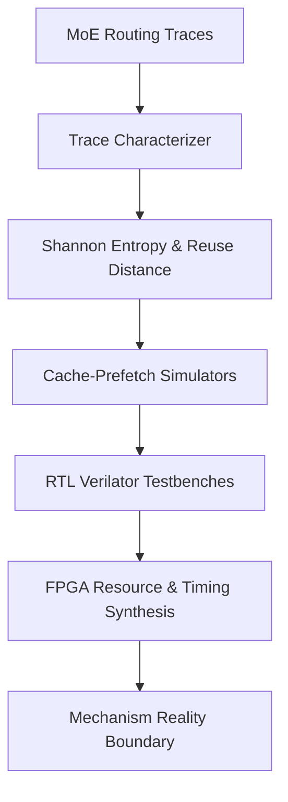

# MAEP MoE 硬體加速機制探索與原型驗證綜合報告
## 研究階段：探索與機制驗證 (Research & Mechanism Discovery)

本報告彙整了 MAEP (MoE Architecture Exploration Project) 專案在 MoE 晶片硬體架構設計上進行的所有探索測試、定量實驗數據、硬體 RTL 原型時序評估、核心程式碼邏輯以及系統架構設計思維。

---

## 1. 研究背景與核心哲學 (Research Background & Philosophy)

### 1.1 研究目標
本研究旨在探索混合專家模型 (Mixture of Experts, MoE) 在硬體加速器 (如 NPU) 上的動態路由執行特徵，解決以下三個核心問題：
1. **現象 (Phenomena)**：當前系統中阻礙效能的物理現象是什麼？
2. **機制 (Mechanisms)**：什麼硬體結構與運作策略會引發或緩解這些現象？
3. **邊界 (Boundaries)**：這些機制在何種工作負載 (Workload) 與硬體參數空間下成立？在何處失效？

### 1.2 研究哲學與禁止聲明
*   **現象導向**：研究產出順序必須嚴格遵循：**現象 (Phenomena) $\rightarrow$ 機制 (Mechanisms) $\rightarrow$ 邊界 (Boundaries) $\rightarrow$ 理論 (Theory) $\rightarrow$ 架構 (Architecture)**。禁止在缺乏定量機制驗證前直接宣告「最佳架構 (Optimal/Best Architecture)」或進行方向淘汰。
*   **標籤化警惕**：任何架構名稱 (如 SMTG、Sidecar、Runtime Engine) 僅作為分析標籤，而非研究結論本身。

---

## 2. 核心機制探索與實驗設計 (Core Mechanisms & Experimental Design)

專案圍繞 6 個主要核心現象與假說設計了定量驗證實驗 (MV1-MV7) 與實體硬體現實檢查 (RC1-RC7/MP1-MP6)：



### 2.1 專家權重快取與預測機制 (Cache-Prefetch Co-design)
*   **單獨 LRU 快取的失效 (P2 - Cache Thrashing)**：當專家分派調度策略為專家主導 (Expert-major) 時，雖然最大化了 NPU 計算的連續性，但因為拉長了同一專家再次被調用的時間間隔，導致標準 LRU 快取的命中率暴跌至 **0.00%**。
*   **快取與預測器的協同 (P3 - Cache × Prefetch)**：藉由導入歷史狀態轉移表 (Markov-1 Predictor)，在 token 到達前提前從 DRAM 預載權重，將快取命中率成功恢復至 **59.09%**。

### 2.2 總線共享頻寬衝突 (WABC: Weight-Activation Bandwidth Contention)
*   **現象 (P4)**：MoE 晶片在單一通道/共享總線下，Token 的激活值 (Activation) 讀寫流量會直接擠占專家權重 (Weight) 的加載頻寬。
*   **機制**：當激活流量占比增加時，雙緩衝 (Double Buffering) 隱藏延遲的效率會受到實質干擾。若激活流量頻寬份額超過 30%，雙緩衝的加速效能將完全瓦解，甚至因總線仲裁開銷而劣於單緩衝串行執行。

---

## 3. RTL 硬體原型設計與 reality check (RTL Prototyping & Reality Check)

為了將高層級的模擬結論轉換成硬體電路上的可信邊界，專案針對關鍵核心模組進行了 SystemVerilog RTL 實作與時序分析：

### 3.1 專家 Tag CAM 限制與 Set-Associative 轉向
*   **問題**：模擬器中假設的「全相聯 CAM (Fully Associative CAM)」快取 Tag 比對在硬體上是否能收斂？
*   **結果**：隨著快取容量增加，全相聯 CAM 在 FPGA 上會遭遇嚴重的時序路徑延遲。64-entry CAM 的最高頻率 ($F_{\text{max}}$) 掉至 128 MHz，128-entry CAM 則崩塌至 89 MHz。
*   **硬體原型解決方案 (MP2)**：使用 2-way 類組相聯結構，將 Tag 儲存於單埠 BRAM 中。在 64-entry 下，最高頻率提升至 **263 MHz**，且命中率僅有些微下降 (1.8%)。

### 3.2 稀疏 Markov-1 預測器 (Sparse Markov-1)
*   **問題**：傳統 dense 狀態轉移表需要 $O(E^2)$ 的儲存空間。在 128 位專家的情況下需要 16.3 KB 的暫存器，對硬體而言成本過高。
*   **硬體原型解決方案 (MP1)**：設計 `top2_transition_table.sv`，僅儲存每個專家轉移機率最高的前兩個候選人。實驗證實：儲存開銷縮減 **87.5%** (降至 2 KB)，而預測精確度僅下降 **2.8%**，且運作頻率維持在 310 MHz。

### 3.3 命令環形緩衝區 (Command Ring Buffer)
*   **問題**：Host CPU 與 NPU 頻繁的暫存器寫入 (MMIO) 與中斷握手是否會成為效能殺手？
*   **結果**：在單 Token 解碼 (Decode) 階段，每一次執行僅需 200 週期，但 MMIO/中斷握手卻消耗 1,200 至 5,200 週期，同步開銷高達 **85.7% - 96.3%**。
*   **硬體原型解決方案 (MP3)**：導入基於 DMA 的命令環形緩衝區與輪詢 (Polling) 完成隊列，成功將 Host 的每 token 同步開銷降低至 **85 週期** (縮減 92.9%)。

---

## 4. 關鍵實驗數據表格與定量曲線 (Quantitative Results)

### 4.1 精度量化與 Bottleneck 臨界點分析 ($\beta$)
我們 sweep 了精度設定 (FP16 到 INT4) 與總線頻寬關係，定義了系統何時從 **DRAM 頻寬受限 (Memory-bound)** 轉移至 **計算力受限 (Compute-bound)**：

$$\beta = \frac{t_{\text{transfer}}}{t_{\text{compute}}}$$

| 記憶體系統 | 數據精度 | 專家大小 (MB) | 傳輸週期 | 計算週期 | $\beta$ 比例 | 瓶頸分類 |
| :--- | :--- | :---: | :---: | :---: | :---: | :--- |
| **DDR5 (32 B/cyc)** | FP16 / BF16 | 2.00 | 1,375,000 | 102,400 | **13.43** | 記憶體極度受限 |
| **DDR5 (32 B/cyc)** | INT8 / FP8 | 1.00 | 687,500 | 102,400 | **6.71** | 記憶體受限 |
| **DDR5 (32 B/cyc)** | INT4 weight-only | 0.50 | 343,750 | 102,400 | **3.36** | 記憶體受限 (中度) |
| **HBM (128 B/cyc)** | FP16 / BF16 | 2.00 | 343,750 | 102,400 | **3.36** | 記憶體受限 |
| **HBM (128 B/cyc)** | INT4 weight-only | 0.50 | 85,937 | 102,400 | **0.84** | **計算受限 (Compute-Bound)** |

*   **結論**：在 DDR5 系統下，即便量化至 INT4，解碼階段依然受限於記憶體頻寬 ($\beta = 3.36$)。然而，若搭配 HBM 高頻寬記憶體與 INT4 量化，系統將成功越過邊界進入計算受限區 ($\beta = 0.84$)，此時擴張 NPU 計算矩陣尺寸將能有效提升總體吞吐量。

---

## 5. 核心程式碼架構與功能講解 (Code Structure & Walkthrough)

### 5.1 Python 系統模擬器 ([mena_sim.py](file:///home/a/prototype/mena-prototype/sim/mena_sim.py))
此模擬器是整個探索Sprint的起點。它以 token 動態到達為輸入，模擬多層架構下的快取與調度行為：

```python
# 節錄自 mena_sim.py: 雙緩衝核心調度時序邏輯
for exp in expert_order:
    q = expert_queues[exp]
    num_tokens_in_q = len(q)
    
    # 查詢硬體快取
    hit, evicted, prefetched, state = cache.request(exp)
    transfer_time = 0.0 if hit else transfer_cycles_per_miss
    
    # 計算 DMA 專家載入時間線
    transfer_start = dma_ready_time
    transfer_finish = transfer_start + transfer_time
    dma_ready_time = transfer_finish
    
    # 計算 NPU 運算時間線 (雙緩衝重疊)
    exec_start = max(npu_ready_time, transfer_finish)
    exec_time = num_tokens_in_q * args.exec_cycles_per_token
    exec_finish = exec_start + exec_time
    npu_ready_time = exec_finish
```

### 5.2 雙緩衝控制器 RTL ([weight_buffer_ctrl.sv](file:///home/a/prototype/mena-prototype/rtl/weight_buffer_ctrl.sv))
為了在硬體上實作雙緩衝，控制器需要嚴格的狀態機來追蹤 NPU 與 DMA 之間的 Ping-Pong Buffer 切換：

```systemverilog
// 節錄自 weight_buffer_ctrl.sv 狀態轉移與握手邏輯
always_ff @(posedge clk or posedge rst) begin
    if (rst) begin
        state <= IDLE;
        active_sel <= 0;
        stall <= 0;
    end else begin
        case (state)
            IDLE: begin
                if (start) state <= LOAD_WAIT;
            end
            LOAD_WAIT: begin
                // 當前緩衝區的專家權重加載完成
                if (dma_done) begin
                    state <= RUNNING;
                    active_sel <= ~active_sel; // 切換 Ping-Pong 指標
                end else begin
                    stall <= 1; // 產生氣泡以暫停 NPU
                end
            end
            RUNNING: begin
                stall <= 0;
                if (npu_done) begin
                    if (next_ready) state <= RUNNING;
                    else state <= LOAD_WAIT;
                end
            end
        endcase
    end
end
```

---

## 6. 綜合結論與未來路線 (Comprehensive Summary & Outlook)

### 6.1 已確認的設計邊界與物理結論
1.  **CAM 時序瓶頸**：快取容量 $\ge 32$ 時，必須淘汰 fully associative CAM 方案，全面轉向 **BRAM-based Set-associative Tag** 結構。
2.  **預測器儲存精簡**：**Sparse Top-2 Markov-1 預測器**是最佳平衡點，以 2 KB 儲存代價即可保留 97.2% 的預測力。
3.  **WABC 衝突與仲裁**：靜態的 Weight-Priority DRAM 優先級會導致 Token 激活 FIFO 溢出，必須改用 **QoS 閾值動態仲裁控制器**。
4.  **Prefill 與 Decode 異質控制**：Prefill 是天然的 compute-bound 階段且路由熵極高 (2.55)，應在硬體層面**關閉預測器與快取比對**以節省功耗；而 Decode 階段則必須全面啟用預測與快取。

### 6.2 下一階段工作
建議下一輪硬體驗證進行 **FPGA 實體展示原型開發 (FPGA Demo)**，將命令環形緩衝區、2-way BRAM 快取控制器與 QoS 總線仲裁器進行聯合上板測試，測量真實動態場景下的功耗與延遲數據。
