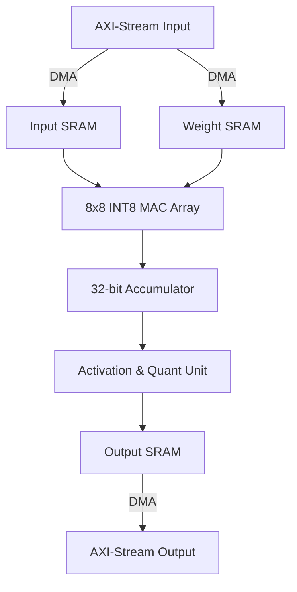

# Lightweight NPU Module Specification Draft (MENA-NPU v1.0)

This document specifies the architecture and interface of the lightweight NPU assist processor for the **MENA (MoE Expert-transfer and NPU Assist)** prototype. The design is optimized for deployment on resource-constrained FPGA platforms like the **PYNQ-Z2**.

---

## 1. Supported Tasks & Operations

The MENA-NPU is designed to accelerate critical routing and small-scale expert computations in Mixture-of-Experts (MoE) networks:

*   **INT8 Small GEMM (General Matrix Multiply)**: Accelerates dense expert layers or linear projections inside MoE layers.
*   **INT8 Matrix-Vector Multiplication (GEMV)**: Used during token-by-token generation phases.
*   **Router MLP Computation**: Computes routing logits ($W_{gate} \cdot x$) to output scores.
*   **Quantization / Dequantization**: Linear scaling from FP32/FP16 activations to INT8 NPU input, and scaling back.
*   **Activation Approximations**:
    *   **ReLU**: Simple thresholding.
    *   **SiLU (Sigmoid Linear Unit) / GELU**: Polynomial or piece-wise linear (LUT-based) approximations.

---

## 2. Hardware Microarchitecture Specifications

The first-version hardware specification is designed to be highly resource-efficient and predictable:

| Component | Specification | Description / Purpose |
| :--- | :--- | :--- |
| **Systolic MAC Array** | 8x8 INT8 MACs | Computes 64 multiply-accumulate operations per cycle. |
| **Accumulator** | 32-bit INT32 | Prevents overflow during MAC operations. |
| **Input SRAM** | 16 KB (128-bit width) | Stores input activations for current token batch. |
| **Weight SRAM** | 64 KB (128-bit width) | Stores loaded expert weights. |
| **Output SRAM** | 16 KB (128-bit width) | Stores intermediate and final results. |
| **Control Interface** | AXI-Lite registers | Configuration, execution trigger, and status checking. |
| **Data Interface** | AXI-Stream / Simple DMA | High-speed data streaming of weights and activations. |

---

## 3. PYNQ-Z2 Hardware Constraints & Boundaries

Deploying the NPU on the **PYNQ-Z2** (Xilinx Zynq-7000 XC7Z020 CLG400-1) imposes strict resource limitations:

> [!WARNING]
> The PYNQ-Z2 contains only **220 DSP slices** and **140 Block RAMs (36Kb each)**. A full-scale LLM layer will NOT fit on this chip.

*   **Limited Computation**: The 8x8 MAC array consumes 64 DSPs (or 32 DSPs using packing techniques), which fits well within the 220 limit.
*   **Small SRAM Footprint**: 96 KB of total on-chip SRAM consumes approx. 24 BRAMs, leaving ample memory for buffers, top-k selectors, and dispatchers.
*   **Target Scope**: First-version prototype will ONLY perform small-scale GEMM (e.g., $128 \times 128 \times 128$) to demonstrate the datapath and controller integration, rather than running a full transformer block.

---

## 4. Roadmap & Future Upgrade Paths

To scale the design from the initial PYNQ-Z2 prototype to larger production platforms (e.g., UltraScale+ or Versal), we propose the following development phases:

1.  **16x16 MAC Array**: Quadruples compute throughput (256 MACs/cycle) for larger hidden sizes.
2.  **Double Buffering**: Implements ping-pong buffers for Input/Weight/Output SRAMs to overlap expert weight transfer (DRAM $\rightarrow$ SRAM) with computation.
3.  **Sparse Expert Compute**: Automatically bypasses zero-valued routing weights or pruned experts to save power and cycles.
4.  **Mixed-Precision Support**: Extends the MAC array to support FP16 and INT4 computations dynamically.
5.  **Direct AXI DMA Integration**: Bypasses the processor control loops to allow the NPU to directly request expert weights from external memory based on dispatcher outputs.
