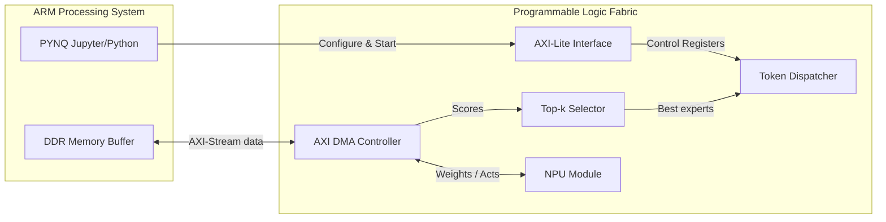

# PYNQ-Z2 Prototyping & Demo Plan

This document outlines the implementation plan for running the **MENA** accelerator hardware prototype on the **PYNQ-Z2** development board.

---

## 1. PS/PL System Architecture

The Zynq-7000 SoC on the PYNQ-Z2 consists of a **Processing System (PS)** with a dual-core ARM Cortex-A9 and a **Programmable Logic (PL)** fabric.

*   **ARM PS (Processing System)**:
    *   Runs the PYNQ Python environment on Linux.
    *   Generates routing inputs and prepares data buffers in DDR memory.
    *   Configures and triggers the hardware accelerator via the AXI-lite control interface.
    *   Verifies execution correctness by comparing PL results with Python golden outputs.
*   **PL Fabric (Programmable Logic)**:
    *   Instantiates the integrated `mena_top` block (Top-k Selector + Token Dispatcher).
    *   Implements the lightweight NPU module for computations.
    *   Implements DMA channels for data transfers.
*   **DDR Memory**:
    *   Serves as the shared memory buffer between PS and PL.
    *   Stores input token scores, dispatch queues, and NPU weight tables.



---

## 2. AXI-Lite Register Map Draft

All control and status indicators are mapped to memory-mapped registers accessible by the ARM processor over an AXI-lite interface:

| Register Name | Offset | Type | Description |
| :--- | :---: | :---: | :--- |
| **CTRL** | `0x00` | R/W | Bit 0: Start accelerator (write 1)<br>Bit 1: Reset (write 1)<br>Bit 2: Interrupt Enable |
| **STATUS** | `0x04` | R/O | Bit 0: Idle<br>Bit 1: Running<br>Bit 2: Done (dispatch completed)<br>Bit 3: Error |
| **NUM_TOKENS** | `0x08` | R/W | Configure token count (Default: 32) |
| **NUM_EXPERTS** | `0x0C` | R/W | Configure expert count (Default: 8) |
| **TOP_K** | `0x10` | R/W | Configure top-k selection (Default: 2) |
| **INPUT_BASE_ADDR** | `0x14` | R/W | Physical DDR memory base address of input score vectors |
| **OUTPUT_BASE_ADDR**| `0x18` | R/W | Physical DDR memory base address for dispatch outputs |
| **TRACE_BASE_ADDR** | `0x1C` | R/W | Physical DDR base address of expert weight metadata |
| **CYCLE_COUNTER** | `0x20` | R/O | Counts total clock cycles elapsed during hardware execution |
| **ERROR_COUNTER** | `0x24` | R/O | Counts queue overflows or protocol mismatch events |

---

## 3. AXI-Stream Data Formats

AXI-Stream channels are used for high-bandwidth data transfers between DDR memory and PL accelerator components:

*   **Input Score Stream**:
    *   Data width: 128 bits.
    *   Format: 8 packed 16-bit scores representing a single token's routing preferences.
    *   Signals: `TDATA`, `TVALID`, `TREADY`, and `TLAST` (asserted on the 32nd token).
*   **Output Dispatch Stream**:
    *   Data width: 32 bits.
    *   Format:
        *   `[7:0]`: Expert ID (target destination).
        *   `[15:8]`: Token ID.
        *   `[31:16]`: Reserved padding.
    *   Signals: `TDATA`, `TVALID`, `TREADY`, and `TLAST` (asserted on the last dispatched item).

---

## 4. PYNQ Python Control Flow

The host script running on the ARM processor coordinates the demo execution using the `pynq` Python package:

```python
from pynq import Overlay, allocate
import numpy as np

# 1. Load the bitstream Overlay
overlay = Overlay("mena_wrapper.bit")
dma = overlay.axi_dma_0
mena_ctrl = overlay.mena_ctrl_0

# 2. Allocate contiguous memory buffers
num_tokens = 32
num_experts = 8
input_buf = allocate(shape=(num_tokens, num_experts), dtype=np.uint16)
output_buf = allocate(shape=(num_tokens * 2,), dtype=np.uint32)

# 3. Write inputs: fill with synthetic test scores
scores = np.random.randint(0, 1000, size=(num_tokens, num_experts), dtype=np.uint16)
np.copyto(input_buf, scores)

# 4. Configure register parameters
mena_ctrl.write(0x08, num_tokens)
mena_ctrl.write(0x0C, num_experts)
mena_ctrl.write(0x10, 2) # TOP_K = 2

# 5. Start DMA transfers and trigger hardware
dma.recvchannel.transfer(output_buf)
dma.sendchannel.transfer(input_buf)
mena_ctrl.write(0x00, 0x1) # Start bit = 1

# 6. Wait / Poll for completion
dma.sendchannel.wait()
dma.recvchannel.wait()

while (mena_ctrl.read(0x04) & 0x4) == 0:
    pass # Wait until Done bit is set

cycles = mena_ctrl.read(0x20)
print(f"Hardware execution completed in {cycles} clock cycles.")

# 7. Compare with Python golden output
# Unpack outputs and verify correctness...
```

---

## 5. First-Version Demo Targets

The initial goal is to demonstrate a fully functional routing loop with the following parameters:

*   **Experts (E)**: 8
*   **Top-K Selection (K)**: 2
*   **Token Batch Size (T)**: 32
*   **Score Bit-width**: 16-bit unsigned integers
*   **Target Clock Frequency**: 100 MHz (10 ns period) on PL
*   **Correctness criteria**: The order and token assignments outputted by the AXI-stream interface must match the Python simulation outputs exactly.
