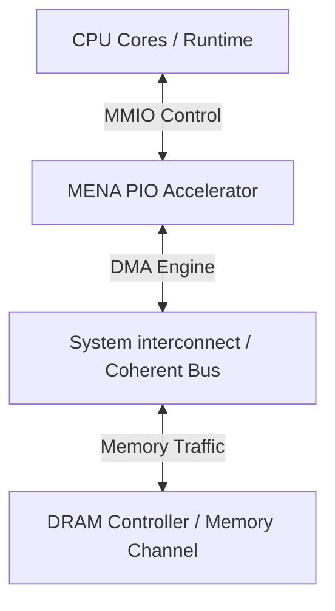

# gem5 Modeling & Integration Plan

Mixture-of-Experts (MoE) routing, dispatch, and expert transfers depend heavily on system-level components like memory bandwidth and DRAM access latencies. This document details the integration plan for modeling the **MENA** accelerator within the **gem5** simulator.

---

## 1. Modeled Components in gem5

To capture realistic performance overheads, the following system blocks will be integrated or simulated in gem5:



*   **CPU Runtime**: Simulates the host CPU executing the MoE orchestration layer (calculating scores, preparing memory layouts, and scheduling NPU work).
*   **MMIO Control Interface (PIO)**: A memory-mapped register interface modeling the accelerator control register accesses.
*   **DMA Latency Engine**: Models the latency of transfering tokens and expert weights between host memory (DRAM) and the NPU local memory (SRAM) over PCIe or custom interconnects.
*   **Memory Bandwidth**: Uses gem5's detailed DRAM models (e.g., LPDDR4/DDR5) to capture memory queuing delays, row-buffer conflicts, and bandwidth saturation.
*   **MENA Timing Model**: Replicates the internal latency of the Top-k selector, Token dispatcher, and NPU compute array.

---

## 2. Simulation Evaluation Modes

We propose two evaluation modes depending on the simulation depth required:

### A. Functional Mode
*   **Purpose**: Verify software control flow and programming interfaces.
*   **Behavior**: Accelerator actions are executed instantly in 0 simulation time. Data is read/written to the gem5 physical memory directly.
*   **Useful for**: Debugging device drivers and software-firmware integration.

### B. Timing Mode (Detailed Mode)
*   **Purpose**: Analyze execution cycles, queue bottlenecks, and memory latency impact.
*   **Behavior**: When triggered, the device computes its completion cycle based on its workload (input token count, cache misses) and posts a gem5 event to resume the CPU after that delay. Memory accesses trigger actual AXI/DMA bus transactions.
*   **Useful for**: Architecture exploration and system-level performance evaluation.

---

## 3. Accelerator Latency Modeling Sources

Rather than running full RTL simulation inside gem5 (which is extremely slow), we will model latency using three configurable sources:

1.  **RTL Verilator Cycle Count**: Incorporate static cycle counts measured directly from Verilator testbench runs (e.g., number of cycles to sort/dispatch $T$ tokens).
2.  **Python Simulator Estimates**: Feed the mathematical cycle estimates from the `mena_sim.py` simulator back into the gem5 config tables.
3.  **Configurable Latency Table**: A simple lookup table mapping different workloads to latency cycles:
    $$\text{Latency} = T_{\text{transfer}} + T_{\text{compute}} + T_{\text{dispatch\_overhead}}$$
    Where $T_{\text{transfer}} = \frac{\text{bytes\_transferred}}{\text{simulated\_memory\_bandwidth}}$.

---

## 4. Implementation Phase Plan

The gem5 integration will follow these 4 phased steps:

```
┌─────────────────┐      ┌─────────────────┐      ┌─────────────────┐      ┌─────────────────┐
│     Phase 1     │ ───> │     Phase 2     │ ───> │     Phase 3     │ ───> │     Phase 4     │
│   Simple PIO    │      │    DMA Model    │      │  Trace Replay   │      │ Sim Integration │
└─────────────────┘      └─────────────────┘      └─────────────────┘      └─────────────────┘
```

### Phase 1: Simple PIO Device
Create a basic `MenaDevice` derived from `BasicPioDevice` in gem5. Establish register read/write overrides for offset registers (like CTRL, STATUS).

### Phase 2: DMA Engine Modeling
Add a gem5 `DmaPort` to the device. Implement DMA read requests to load scores and write requests to dump dispatch outputs.

### Phase 3: Trace Replay Integration
Create a gem5 simulation script that loads our synthetic JSONL traces and replays the memory accesses and device triggers cycle-by-cycle.

### Phase 4: Full System-Level Simulation
Integrate the Python system simulator results with gem5 CPU profiling. Evaluate the system speedups from different expert caching policies under different CPU core designs and memory bandwidth constraints.
